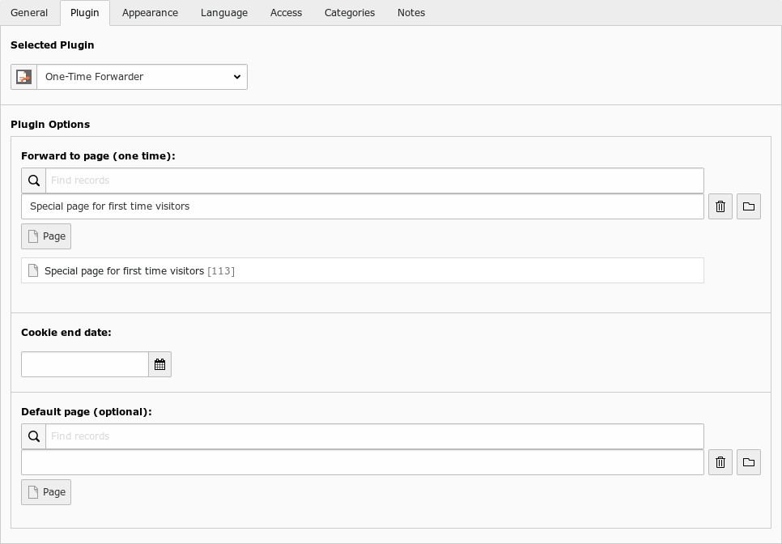

.. ==================================================
.. FOR YOUR INFORMATION
.. ================================================--
.. -*- coding: utf-8 -*- with BOM.

.. include:: ../Includes.txt

==============================
Usage
==============================

The plugin stores the information if a user visited the page already for each page separately. The concept is to place
the plugin on one page only (home page for example). Therefore the normal way of using this plugin is just with a
“insert plugin” record.

.. warning::

    The plugin is not meant to be included on every page, which means including the plugin by typoscript is not the
    usual way to use this plugin. Keep in mind: the plugin creates a separate cookie for every page.

1. Include Plugin
=================

Just insert the plugin on a page with an “insert plugin” record. For the configuration the plugin provides a form.

    example plugin configuration

2. Include TypoScript
=====================

You may include the plugin into your TypoScript template like this:

.. code-block:: typoscript

    page.50 < plugin.tx_cookie_redirect_pi1

In a fluid template this would look like this:

.. code-block:: html

    <f:cObject typoscriptObjectPath="plugin.tx_cookie_redirect_pi1"/>

Configuration
=============

For configuration use the plugin form or set the values in TypoScript:

.. code-block:: typoscript

    plugin.tx_cookieredirect_pi1 {

        // default is: tx_cookieredirect_pi1
        cookiePrefix =

        // cookie lifetime in seconds
        cookieLifetime = 10000000

        // one-time redirect PID
        shortcutPID =

        // default PID - default is current page
        defaultPID =
    }

